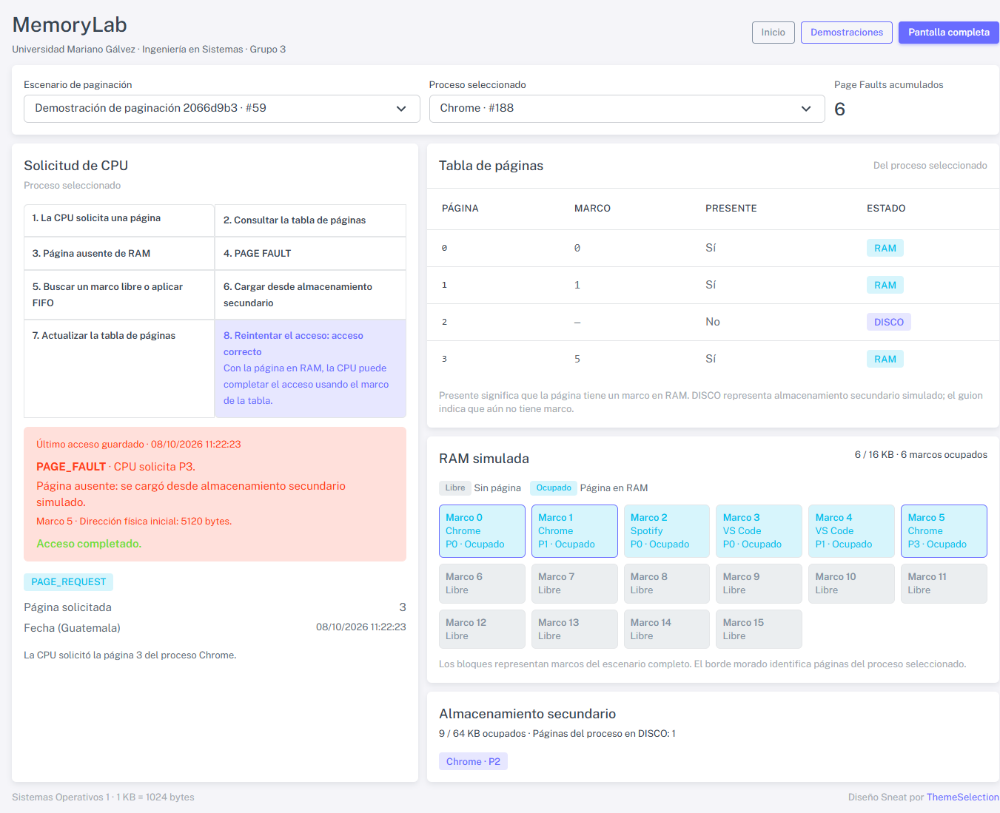
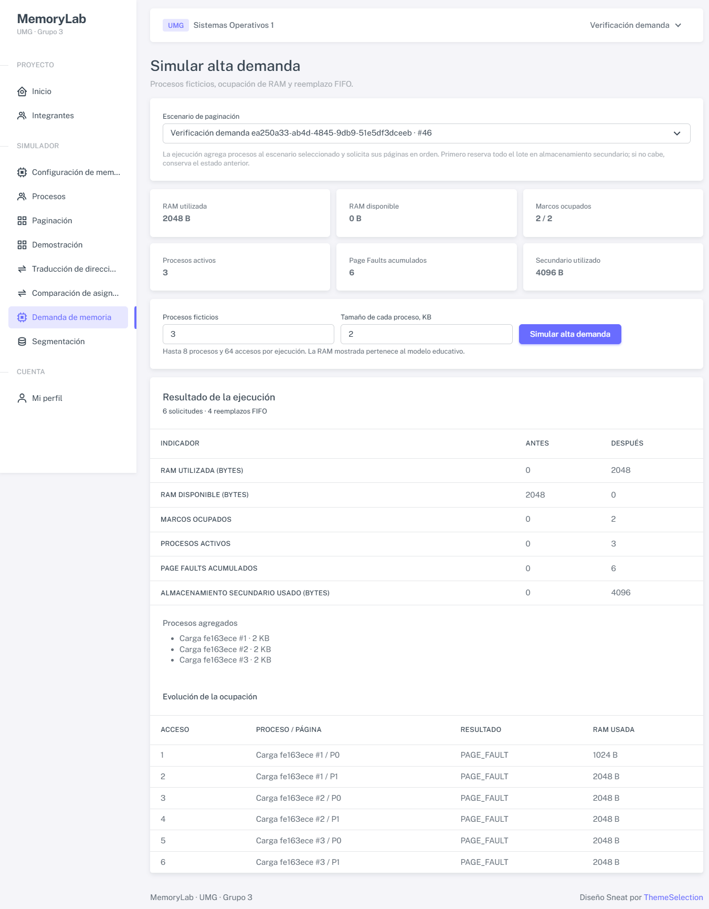

# MemoryLab: informe técnico

Universidad Mariano Gálvez · Ingeniería en Sistemas · Sistemas Operativos 1 · Grupo 3

Fecha de corte: 8 de octubre de 2026.

Informe técnico del proyecto

Universidad Mariano Gálvez

Ingeniería en Sistemas

Sistemas Operativos 1

Grupo 3

| Integrante | Carné |
| --- | --- |
| Enmer Antonio Buch Xinic | 1990-22-15514 |
| Lester Emilio Pedro Juan | 6590-23-7214 |
| Deivid Alberto Guerra Carpio | 0905-24-23552 |
| Rebeca Alizon Najarro Duarte | 3190-23-11451 |
| Carlos Lopez Urizar | 6590-24-18604 |

Fecha de corte: 8 de octubre de 2026. La aplicación funciona en Apache local. Este informe describe la implementación, las demostraciones y las verificaciones conservadas en el repositorio.

Contenido: objetivos y arquitectura; modelo MySQL; paginación; traducción y segmentación; comparación y demanda; permisos y pruebas; uso de IA y conclusiones; guía de demostración y referencias.

## 1. Objetivos y arquitectura

MemoryLab permite observar cómo un proceso utiliza memoria bajo paginación y segmentación. El estudiante configura una memoria pequeña, solicita páginas, traduce direcciones y compara técnicas con datos persistidos. La interfaz muestra el motivo de cada resultado y su efecto en RAM y almacenamiento secundario.

### Alcance académico

El objetivo general es explicar la administración de memoria mediante operaciones repetibles. Los objetivos específicos son identificar páginas y marcos; distinguir Page Hit y Page Fault; aplicar base y límite a un segmento; y relacionar fragmentación y capacidad con la asignación contigua y no contigua.

Los tamaños, direcciones y procesos pertenecen a una simulación educativa. MemoryLab no inspecciona las tablas de páginas del sistema operativo, no reserva físicamente la RAM declarada y no ejecuta procesos del equipo. La terminal reconoce un conjunto cerrado de comandos educativos.

### Separación de responsabilidades

Figura 1. La interfaz delega las acciones a Livewire. Los Services autorizan y ejecutan operaciones transaccionales mediante Eloquent y MySQL.

Laravel atiende rutas y autenticación. Jetstream/Fortify aporta el acceso y Livewire mantiene los formularios y paneles. Bootstrap 5 y Sneat Free definen la presentación. JavaScript anima resultados del servidor y controla la pantalla completa. Los algoritmos y el estado autoritativo permanecen en los Services.

| Componente | Versión comprobada |
| --- | --- |
| PHP / Laravel | 8.2.12 / 12.69.3 |
| Jetstream / Livewire / Fortify | 5.5.3 / 3.8.10 / 1.41.0 |
| Bootstrap / Sneat Free / Vite | 5.3.8 / 2.0.0 / 6.4.4 |
| MySQL Community Server | 8.0.44, motor InnoDB |

## 2. Modelo de datos e integridad

El dominio utiliza siete tablas. scenario_id separa las simulaciones. Las referencias compuestas impiden vincular una página, un segmento, un evento o un marco con un proceso de otro escenario. Las cuentas y los permisos utilizan las tablas de autenticación correspondientes.

Figura 2. Relaciones principales del dominio. Todas las entidades pertenecen a un escenario. Pages referencia un proceso y, cuando reside en RAM, un marco. Segmentos y eventos también referencian procesos. El diagrama completo está en docs/modelo-memoria.md.

| Tabla | Responsabilidad |
| --- | --- |
| scenarios | Nombre, modo PAGING/SEGMENTATION/CONTIGUOUS, estado y demostración. |
| memory_configurations | RAM, tamaño de página y capacidad secundaria, expresados en bytes. |
| processes | Nombre, tamaño y estado del proceso. |
| memory_frames | Marcos consecutivos desde cero dentro del escenario. |
| pages | Página lógica, marco nullable y fecha loaded_at para FIFO. |
| segments | Nombre, base, tamaño y estado ACTIVE/RELEASED. |
| simulation_events | Actor, tipo, fecha UTC con microsegundos y contexto JSON. |

La auditoría del esquema confirmó 12 claves foráneas, 6 restricciones CHECK y 7 claves únicas. frame_id único permite como máximo una página por marco. Configuración, proceso y número de página o segmento mantienen sus propias unicidades. Los Services validan además geometría, capacidad, pertenencia y solapamientos entre registros.

Las operaciones de escritura toman el bloqueo de la misma fila del escenario dentro de una transacción. El reinicio libera asignaciones y termina procesos, pero conserva escenario, configuración e historial. Una cuenta eliminada deja el actor histórico en null en lugar de eliminar su evidencia.

## 3. Paginación y solicitudes de CPU

La paginación divide el espacio lógico en unidades de tamaño fijo y representa la memoria física con marcos del mismo tamaño. La tabla de páginas permite localizar el marco de cada página. Esta base conceptual se presenta en OSTEP, capítulo 18.

[Referencia conceptual: OSTEP, Paging: Introduction](https://pages.cs.wisc.edu/~remzi/OSTEP/vm-paging.pdf)

En MemoryLab, 1 KB equivale a 1024 bytes. Con RAM de 16 KB y páginas de 1 KB existen 16 marcos. Un proceso de 6 KB tiene 6 páginas. Un tamaño no múltiplo reserva la última página completa. Al crear un proceso, todas sus páginas comienzan en secundaria con frame_id null.

### Resolución de una solicitud

| Resultado | Operación del servidor |
| --- | --- |
| Page Hit | La página ya tiene marco. Registra PAGE_REQUEST y PAGE_HIT, conserva ubicación y antigüedad FIFO. |
| Page Fault con espacio | Registra el fallo, elige el marco libre de menor número y carga la página. |
| Page Fault con RAM llena | Elige globalmente el residente más antiguo por loaded_at e id, libera su marco y carga la página solicitada. |

La resolución valida el actor y es idempotente para una solicitud ya completada. Un reinicio posterior invalida pendientes anteriores. El modo paso a paso muestra la consulta, el fallo o hit, la carga y el acceso físico sobre el mismo algoritmo del modo automático.

Simplificación explícita: cada página ocupa RAM o secundaria de forma exclusiva. La reserva secundaria se calcula con páginas sin marco por tamaño de página. El simulador comprueba la capacidad al crear y reemplazar páginas. El historial conserva la solicitud, el resultado y la víctima del reemplazo.

## 4. Direcciones y segmentación

### Traducción de dirección lógica

Para una dirección lógica válida, la página se obtiene con la división entera entre el tamaño de página. El desplazamiento es el residuo. Si la página reside en RAM, la dirección física es marco × tamaño de página + desplazamiento. El servicio exige 0 ≤ dirección lógica < tamaño real del proceso y consultar una traducción no carga páginas ni genera eventos.

| Ejemplo didáctico | Cálculo |
| --- | --- |
| Página de 1024 bytes, dirección lógica 1124 | Página 1 y desplazamiento 100. |
| Entrada de tabla: página 1 en marco 5 | Dirección física = 5 × 1024 + 100 = 5220. |
| Página sin marco | Sin dirección física. Una solicitud de CPU puede resolver el fallo. |

### Base y límite de un segmento

La segmentación organiza un proceso en regiones lógicas de tamaño variable. Base y límite permiten validar y traducir un acceso. En la implementación, cada segmento activo ocupa un intervalo contiguo [base, base + tamaño), aunque los segmentos de un proceso pueden estar separados. El capítulo 16 de OSTEP explica este modelo conceptual.

[Referencia conceptual: OSTEP, Segmentation](https://pages.cs.wisc.edu/~remzi/OSTEP/vm-segmentation.pdf)

| Condición | Resultado implementado |
| --- | --- |
| 0 ≤ offset < tamaño | Dirección física = base + offset. Un evento SEGMENT_ACCESS. |
| offset ≥ tamaño | SEGMENTATION_FAULT y dirección física null. RAM y estados se conservan. |
| Base 1000, tamaño 1200, offset 100 | Acceso válido a 1100. Último offset válido: 1199. |
| Base 1000, tamaño 1200, offset 1200 | Fallo por límite. Caso verificado en navegador. |

La asignación comprueba límite de RAM, suma de tamaños del proceso, número de segmento y ausencia de solapamientos activos. Permite regiones adyacentes. El mapa intercala segmentos y huecos libres. El selector utiliza el primer segmento activo para evitar seleccionar uno liberado.

La segmentación de MemoryLab utiliza bases no negativas y desplazamientos crecientes. No incluye crecimiento descendente de stack, permisos por segmento, TLB ni niveles de tablas. Estos límites mantienen el ejemplo matemático verificable.

## 5. Comparación y alta demanda

La fragmentación externa aparece cuando el espacio libre total se reparte entre huecos que no permiten una asignación contigua suficientemente grande. La fragmentación interna corresponde al espacio reservado que queda sin utilizar dentro de una unidad. OSTEP, capítulo 17, fundamenta la discusión sobre administración del espacio libre.

[Referencia conceptual: OSTEP, Free-Space Management](https://pages.cs.wisc.edu/~remzi/OSTEP/vm-freespace.pdf)

### Ejemplo controlado del comparador

El comparador puro usa RAM de 16384 bytes, bloques ocupados A de 0 a 4095 y B de 7168 a 10239, y huecos de 3072 y 6144 bytes. Hay 9216 bytes libres, pero el mayor hueco mide 6144. La solicitud predeterminada es 7168 bytes.

| Técnica | Resultado para 7168 bytes |
| --- | --- |
| Contigua | Rechaza: el proceso completo supera el mayor hueco. |
| Paginación, páginas de 1024 | Acepta: distribuye 7 páginas entre los marcos libres. |
| Segmentación del ejemplo | Acepta: Código de 4096 en base 10240 y Datos de 3072 en base 4096. |

Para 7500 bytes, paginación reserva 8192 y deja 692 bytes internos sin uso. Una solicitud de 9217 bytes falla en las tres técnicas. La segmentación distribuye dos segmentos ilustrativos con first fit. El comparador revierte el intento parcial que falla y no modifica escenarios, eventos ni tablas.

### Demanda simulada

El módulo de alta demanda crea un lote limitado y solicita sus páginas mediante los mismos Services. Registra hasta 64 muestras reales de progreso. La transacción revierte el lote completo si faltan permisos o capacidad. No mide consumo de RAM del equipo ni rendimiento de Linux.

Caso verificado: 3 procesos de 2 KB, páginas de 1 KB y RAM de 2 KB producen 6 Page Faults y 4 reemplazos FIFO. Al final, RAM utiliza 2048 bytes y secundaria 4096. El escenario contiene 23 eventos, incluidos sus 2 eventos de preparación.

## 6. Permisos y verificación

| Rol | Capacidad |
| --- | --- |
| Administrador | 13 permisos: cuentas, configuración, escenarios, simulación, procesos, accesos, reinicio, historial y consultas. |
| Operador | 8 permisos: procesos, solicitudes de páginas, segmentación y ejecución, además de las cuatro consultas. |
| Observador | 4 permisos de consulta: memoria, tablas, simulaciones y resultados. El registro público asigna este rol. |

Las acciones protegidas y los servicios operativos recargan al usuario y vuelven a comprobar permisos. Los componentes autorizados invocan los cálculos puros y las estadísticas. La administración impide quitar el último Administrador. Observador puede consultar periódicamente resultados de otra cuenta sin repetir el acceso.

### Resultado integral, fase 27

| Verificación | Evidencia al 8 de octubre |
| --- | --- |
| Suite de pruebas con MySQL separado | 655 aprobadas, 1 omitida condicional, 4575 aserciones, 96,78 segundos. |
| Estilo y sintaxis | Pint aprobado y 117 archivos PHP con sintaxis correcta. |
| Dependencias y assets | Composer validate --strict --no-check-publish y compilación Vite aprobados. |
| Persistencia | Siete tablas InnoDB. 12 FK, 6 CHECK y 7 claves únicas. |
| Navegador | Tres roles, acciones y resultados, recursos locales, consulta sin mutación y anchos de 320 a 1920 según módulo. |

La omisión pertenece a la prueba condicional de Jetstream para registro deshabilitado: el registro está habilitado en esta configuración. RegistrationDisabledTest verifica de forma independiente el bloqueo de GET/POST y la ausencia de enlaces al desactivar el registro.

Las pruebas cubren límites, referencias entre escenarios, autorizaciones revocadas, revalidación tras operaciones intercaladas, atomicidad, idempotencia y FIFO. No incluyen contención simultánea entre conexiones paralelas. Las verificaciones de navegador comparan firmas de las siete tablas para confirmar consultas sin cambios. Las fixtures temporales se eliminan al terminar y la base de trabajo se conserva.

### Demostraciones iniciales

El seeder explícito preparó paginación de 16 KB y segmentación de 16 KB usando una cuenta Administrador existente. Repetirlo dejó el estado idéntico. La base local conserva 2 usuarios, 3 escenarios, 5 procesos, 32 marcos, 15 páginas, 4 segmentos y 26 eventos. No crea cuentas de integrantes.

## 7. Uso de IA y conclusiones

Codex participó como asistente de análisis, implementación y verificación. El usuario estableció tecnologías, secuencia y datos académicos; después autorizó completar todas las fases sin confirmaciones adicionales. La evidencia incluye la solicitud original y documentos de cada fase con decisiones, correcciones y resultados. Este informe no atribuye automáticamente a los integrantes una revisión manual que no está registrada.

| Evidencia conservada | Decisión o corrección comprobable |
| --- | --- |
| solicitud-inicial.md y avance.md | Stack obligatorio, 32 fases y autorización para continuar. |
| fase-3.md y capturas de registro | La revisión HTTP no detectó el logo sobredimensionado. Se sustituyeron clases incompatibles y se comprobó visualmente en escritorio y móvil. |
| fase-8.md y modelo-memoria.md | MySQL oficial, relaciones compuestas y reglas del esquema. |
| fase-15.md, fase-19.md y fase-23.md | FIFO por fecha de carga, selección de segmentos activos y validación de filtros y fechas. |
| fase-25.md y fase-26.md | Resultados persistidos para Observador y seeder idempotente que conserva cuentas y escenarios anteriores. |
| fase-27.md | Suite integral y verificación de integridad, sintaxis y compilación. |

### Conclusiones técnicas

1. La tabla de páginas relaciona páginas lógicas con marcos. Una consulta a una página ausente requiere una operación de carga antes de obtener dirección física. El modelo hace visible esa diferencia y conserva el contexto del resultado.

2. La validación del desplazamiento debe preceder a la suma de la base. Para tamaño 1200, el offset 1199 es válido y 1200 falla. El acceso fuera del límite conserva la asignación y registra el motivo del fallo.

3. El espacio libre total no garantiza una asignación contigua. La comparación de 7168 bytes, con un hueco máximo de 6144, muestra por qué páginas o segmentos separados pueden aprovechar huecos distintos.

4. Permisos, referencias compuestas y transacciones coordinan la simulación compartida. Las pruebas automatizadas y la revisión visual cubren aspectos diferentes. El error inicial del registro mostró la necesidad de comprobar ambos.

5. La VM es una ampliación opcional. La instalación local funciona y la guía incluye Apache/Nginx, PHP y MySQL. Una instalación Linux posterior puede comparar sus métricas reales con la simulación, conservando la distinción entre ambos sistemas.

## 8. Guía de demostración y fuentes

### Recorrido recomendado

| Paso | Acción y observación |
| --- | --- |
| 1. Acceso | Entrar con una cuenta ya autorizada y abrir Demostración. Preparar o seleccionar la pareja de escenarios. |
| 2. Paginación | Seleccionar Chrome. Página 0 ya reside en RAM: solicitarla produce Hit. Página 3 comienza en secundaria: solicitarla produce Fault y carga. |
| 3. Traducción | Consultar una dirección lógica válida y contrastar página, desplazamiento y marco. Una página ausente devuelve dirección física null. |
| 4. Segmentación | Seleccionar Editor y Código, base 1000 y tamaño 1200. Offset 100 devuelve 1100; offset 1200 muestra fallo. |
| 5. Comparación | Solicitar 7168 bytes y explicar hueco máximo, marcos y segmentos. Revisar después 7500 y su fragmentación interna. |
| 6. Cierre | Mostrar historial, terminal y /presentation. Reiniciar solo el escenario elegido cuando corresponda. El historial conserva la operación. |

URL local: http://localhost/sistemg3/public/. La guía de instalación y los ejemplos de servidor están en docs/despliegue.md y deploy/. La regeneración del informe usa scripts/artifacts/build-report.py con ReportLab y fuentes Arial. La instalación y ejecución del proyecto se documentan en README.md.

### Referencias conceptuales

[Arpaci-Dusseau y Arpaci-Dusseau. OSTEP, capítulo 18: Paging: Introduction.](https://pages.cs.wisc.edu/~remzi/OSTEP/vm-paging.pdf)

[Arpaci-Dusseau y Arpaci-Dusseau. OSTEP, capítulo 16: Segmentation.](https://pages.cs.wisc.edu/~remzi/OSTEP/vm-segmentation.pdf)

[Arpaci-Dusseau y Arpaci-Dusseau. OSTEP, capítulo 17: Free-Space Management.](https://pages.cs.wisc.edu/~remzi/OSTEP/vm-freespace.pdf)

### Fuentes del proyecto

Requisitos: docs/evidencias/solicitud-inicial.md. Arquitectura y datos: docs/modelo-memoria.md y config/memorylab.php. Evidencias de implementación: docs/evidencias/fase-1.md a fase-28.md y sus capturas. Uso de IA: docs/uso-ia.md. Código de referencia: app/Services, app/Livewire, database/migrations y tests/Feature.

Las cifras de pruebas corresponden al cierre de la fase 27. Los ejemplos de direcciones distinguen cálculos didácticos de casos verificados en navegador. Las capturas incluidas pertenecen a la aplicación real. No se afirma despliegue externo ni ejecución de una VM.
