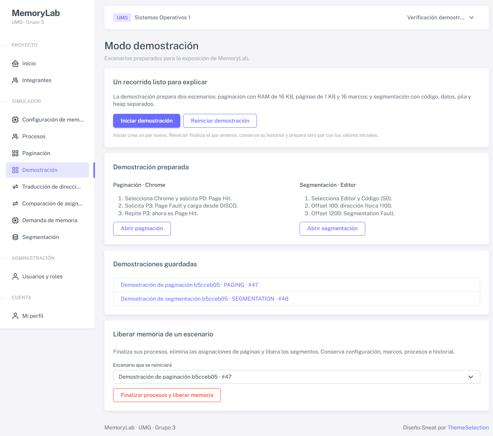
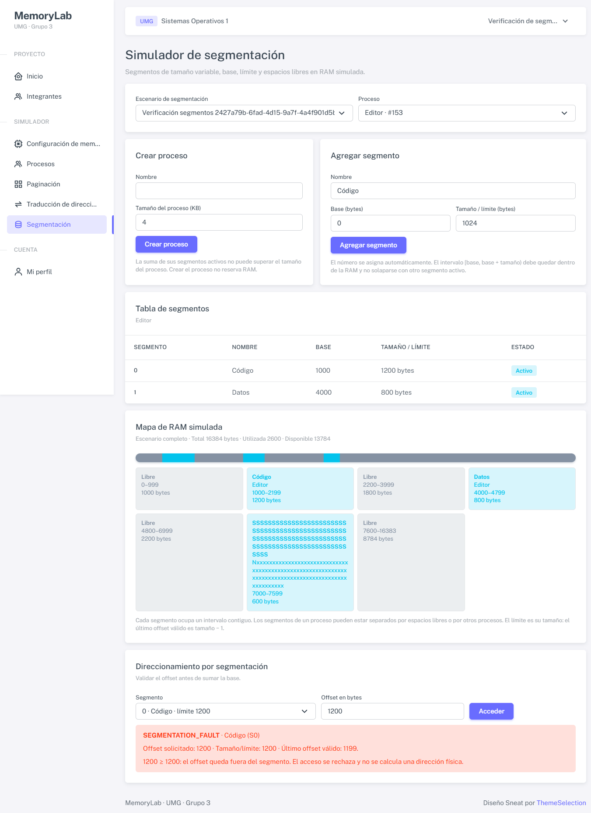
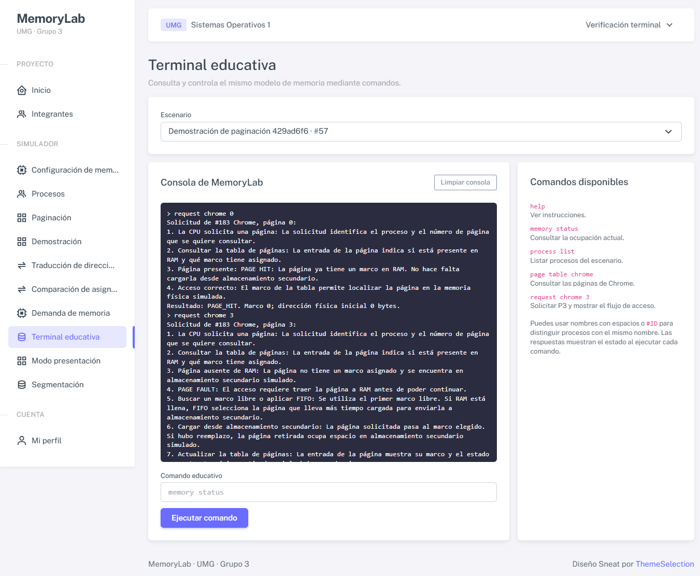

# MemoryLab

## Manual de uso y secuencia de demostración

**Universidad Mariano Gálvez**

Ingeniería en Sistemas · Sistemas Operativos 1 · Grupo 3

| Integrante | Carné |
| --- | --- |
| Enmer Antonio Buch Xinic | 1990-22-15514 |
| Lester Emilio Pedro Juan | 6590-23-7214 |
| Deivid Alberto Guerra Carpio | 0905-24-23552 |
| Rebeca Alizon Najarro Duarte | 3190-23-11451 |
| Carlos Lopez Urizar | 6590-24-18604 |

### ¿Qué vamos a demostrar?

Usaremos MemoryLab para explicar cómo un proceso accede a memoria, qué ocurre cuando una página está ausente y cómo se valida el límite de un segmento. También compararemos tres técnicas de asignación y provocaremos reemplazos FIFO en una prueba controlada. La RAM y el disco mostrados pertenecen al modelo educativo: no son el uso real del equipo.

### Orden recomendado

| Orden | Pantalla y actividad | Página del manual |
| --- | --- | --- |
| 1 | Iniciar sesión y preparar una demostración nueva | 2 |
| 2 | Chrome P0: Hit; Chrome P3: Fault y carga | 3 |
| 3 | Traducir una dirección; validar el límite de Código | 4 |
| 4 | Comparar asignación; mostrar FIFO en otro escenario | 5 |
| 5 | Consultar historial, terminal y modo presentación | 6 |
| 6 | Guardar evidencia; finalizar o reiniciar al terminar | 7 |
| 7 | Exponer los conceptos y resultados de la tarea | 8 |

**Antes de empezar:** una cuenta existente con rol Administrador prepara los escenarios. Administrador u Operador realiza los accesos. Observador puede seguir los resultados guardados. Mantenga la demo principal separada de la prueba de alta demanda.

Edición: 8 de octubre de 2026. Los nombres de controles y resultados se comprobaron en las vistas y servicios del proyecto. Las capturas son evidencias previas de la aplicación; los identificadores de una nueva demostración serán diferentes.

<!-- pagebreak -->

## 1. Entrar y preparar la demostración

### Acceso y roles

1. Abra `http://localhost/sistemg3/public/login` en la instalación local. En otra instalación, use la dirección que le indicó quien administra la aplicación.
2. Complete **Correo electrónico** y **Contraseña** con su cuenta existente; pulse **Iniciar sesión**. Este manual no incluye ni crea contraseñas.
3. Compruebe el menú de Inicio. Si una acción no aparece, revise su rol con el administrador; cambiar la dirección del navegador no concede permisos.

| Rol | Qué puede hacer en este recorrido |
| --- | --- |
| Administrador | Preparar demo, configurar memoria, ejecutar, consultar historial y reiniciar. |
| Operador | Abrir escenarios existentes, crear procesos, ejecutar páginas, segmentos y alta demanda. |
| Observador | Consultar tablas, resultados, comparación, comandos de lectura y modo presentación. |

### Crear un punto de partida reproducible

1. Como Administrador, abra **Demostración** y pulse **Iniciar demostración** una vez. Se crea un par nuevo: PAGING y SEGMENTATION, con el mismo sufijo en el nombre.
2. Anote el nombre y `#ID` de ambos escenarios. **Demostración preparada** ofrece **Abrir paginación** y **Abrir segmentación**. También se pueden abrir desde **Demostraciones guardadas**.
3. Use **Abrir paginación**. En **Seleccionar proceso**, elija **Chrome** explícitamente. Al abrir otras pantallas, vuelva a comprobar escenario y proceso: el proceso no se elige automáticamente.

<!-- crop: 305,306,710,356; max-height=62 -->

### Estado inicial que debe encontrar

**Unidades:** 1 KB equivale a 1024 bytes; las direcciones y offsets se ingresan en bytes.

| Paginación nueva | Valor esperado |
| --- | --- |
| RAM / página / secundaria | 16 KB / 1 KB / 64 KB; 16 marcos |
| Procesos | Chrome 4 KB, Spotify 3 KB, VS Code 6 KB, MemoryLab 2 KB |
| Páginas residentes | Chrome P0/P1, Spotify P0, VS Code P0/P1: 5 en total |
| Secundaria / Page Faults | 10 páginas en DISCO; 5 fallos por las cargas iniciales |

El par de segmentación contiene Editor de 4 KB con Código, Datos, Stack y Heap. Sus cuatro segmentos activos ocupan **3600 bytes**. Si los valores ya cambiaron, otra persona pudo usar ese escenario: prepare un par nuevo para este guion.

<!-- pagebreak -->

## 2. Paginación: mostrar Hit y Fault

### Primero: Chrome P0 produce PAGE_HIT

1. En **Paginación**, seleccione el escenario PAGING del par nuevo y el proceso **Chrome**.
2. En **Solicitud de CPU**, deje **Modo de simulación: Automático**. En **Página del proceso Chrome**, elija **Página 0 · RAM** y pulse **Acceder a página**.
3. Muestre el resultado **PAGE_HIT**: P0 ya está en el marco 0. La dirección física inicial es 0 bytes. Siguen ocupados 5 marcos y el contador de Page Faults sigue en 5.

**Qué explicar:** la tabla evita cargar de nuevo una página presente. Un Hit no es un Page Fault ni cambia el orden de carga que utiliza FIFO.

### Después: Chrome P3 produce PAGE_FAULT

1. Cambie **Modo de simulación** a **Paso a paso** y elija **Página 3 · DISCO**. Pulse **Acceder a página**; comienza el paso 1 y se registra PAGE_REQUEST.
2. Pulse **Siguiente** y explique cada estado en este orden. No cambie el escenario ni el proceso durante el recorrido.

| Paso | Qué mostrar o decir |
| --- | --- |
| 1-2 | La CPU solicita P3 y consulta la tabla. |
| 3-4 | P3 está ausente; el acceso necesita PAGE_FAULT. |
| 5 | Se busca el primer marco libre: marco 5. Aquí aún no hace falta FIFO. |
| 6 | Se confirma la carga real. RAM y tabla cambian; el servidor revalida el estado. |
| 7-8 | Se explica la actualización de la tabla y el acceso correcto. Continúe hasta el paso 8. |

| Indicador global del escenario | Antes de P3 | Después de cargar P3 |
| --- | --- | --- |
| Marcos / RAM utilizada | 5 / 5120 B | 6 / 6144 B |
| Páginas en DISCO / secundaria | 10 / 10240 B | 9 / 9216 B |
| Page Faults acumulados | 5 | 6 |
| Chrome: RAM / DISCO | P0, P1 / P2, P3 | P0, P1, P3 / P2 |

<!-- crop: 32,577,549,759; max-height=86 -->

Al repetir P3 en Automático, ahora obtendrá **PAGE_HIT** y los valores anteriores se mantienen. **Cerrar recorrido** limpia la explicación local; no libera memoria ni deshace una carga ya confirmada. Si otra persona modificó la RAM durante el paso a paso, el resultado puede adaptarse al estado actual.

<!-- pagebreak -->

## 3. Traducir direcciones y validar segmentos

### Traducción después de cargar Chrome P3

1. Abra **Traducción de direcciones**. Seleccione el mismo escenario PAGING y **Chrome**.
2. En **Dirección en bytes, desde cero**, escriba **3500** y pulse **Traducir dirección**.

| Cálculo | Resultado esperado |
| --- | --- |
| Página = floor(3500 / 1024) | 3 |
| Offset = 3500 % 1024 | 428 bytes |
| P3 en la tabla después del recorrido anterior | Marco 5 |
| Dirección física = 5 × 1024 + 428 | **5548 bytes** |

3. Escriba **2500** y traduzca de nuevo: página 2, offset 452. Chrome P2 sigue en DISCO, por lo que aparece **Página no presente** y no hay dirección física. Este cálculo no la carga ni aumenta los fallos.

El rango válido de Chrome es **0 a 4095** porque ocupa 4096 bytes. Una dirección fuera del tamaño real se rechaza; no se usa el relleno de una página como memoria válida del proceso.

### Segmentación: Editor y Código (S0)

1. Abra **Demostración** y **Abrir segmentación**, o seleccione el escenario SEGMENTATION del mismo par. Elija el proceso **Editor**.
2. En **Direccionamiento por segmentación**, seleccione **0 · Código · límite 1200**. Su base es 1000 bytes. Escriba cada valor en **Offset en bytes** y pulse **Acceder**.

| Offset | Validación | Resultado |
| --- | --- | --- |
| 100 | 100 < 1200 | SEGMENT_ACCESS; física 1100 |
| 1199 | Último offset válido | SEGMENT_ACCESS; física 2199 |
| 1200 | 1200 >= 1200 | SEGMENTATION_FAULT; sin dirección física |

**Qué explicar:** se verifica `0 <= offset < tamaño` antes de sumar la base. El fallo registra un evento y no cambia la RAM ni asignaciones. La demo conserva **3600 bytes usados y 12784 disponibles** después de los tres accesos.

<!-- crop: 309,1653,1318,1759; max-height=62 -->

El segmento Código ocupa 1000 a 2199; Datos, Stack y Heap están separados. Los segmentos de un proceso no necesitan ser adyacentes, pero cada segmento ocupa un intervalo contiguo. La captura ilustra el control de límite; su escenario de verificación no es el nuevo par del guion.

<!-- pagebreak -->

## 4. Comparar asignación y provocar FIFO

### Comparación con huecos de 3 KB y 6 KB

1. Abra **Comparación de asignación**. En **Tamaño solicitado en bytes**, ingrese **7168** y pulse **Comparar asignación**.
2. Explique que las tres técnicas parten de RAM de 16 KB: A/B ocupan 7 KB, hay 9 KB libres en total y el mayor hueco mide 6 KB.

| Técnica | Resultado con 7168 bytes | Explicación |
| --- | --- | --- |
| Contigua | Rechazada | Un bloque de 7 KB no cabe en el mayor hueco de 6 KB. |
| Paginación | Aceptada; 7 páginas; desperdicio 0 | Páginas de 1 KB se distribuyen en marcos libres. |
| Segmentación | Aceptada; desperdicio 0 | Código 4096 B y Datos 3072 B caben en huecos separados. |

3. Pruebe **7500**: paginación reserva 8 × 1024 = 8192 bytes y desperdicia **692** dentro de la última página. Segmentación reserva 7500 y no agrega ese relleno; contigua sigue rechazada. La comparación es matemática y no altera sus escenarios.

### Alta demanda: use un escenario separado y vacío

1. Como Administrador, abra **Configuración de memoria**. En **Escenario**, elija **Crear un escenario nuevo**. Nombre: **Prueba FIFO**. Ingrese **RAM total (KB): 2**, **Tamaño de página (KB): 1** y **Almacenamiento secundario (KB): 16**. Pulse **Guardar configuración**. Anote el nuevo `#ID`.
2. Abra **Demanda de memoria** y seleccione ese escenario, no el par de demostración. Administrador u Operador ingresa **Procesos ficticios: 3** y **Tamaño de cada proceso, KB: 2**. Pulse **Simular alta demanda** una sola vez.
3. Muestre **Resultado de la ejecución**, **Evolución de la ocupación** y el mapa RAM en Paginación del mismo escenario. Se crean procesos con nombres Carga y un identificador de ejecución.

| Indicador de Prueba FIFO vacía | Antes | Después |
| --- | --- | --- |
| Procesos activos / solicitudes | 0 / 0 | 3 / 6 |
| RAM utilizada / marcos ocupados | 0 B / 0 | 2048 B / 2 |
| Secundaria utilizada | 0 B | 4096 B |
| Page Faults / reemplazos FIFO | 0 / 0 | 6 / 4 |

**Qué demostrar:** los primeros dos accesos llenan la RAM; los cuatro siguientes reemplazan la página cargada más antigua. La RAM no supera 2 KB. Primero se reserva el lote completo en secundaria; si no cabe, la ejecución se revierte. Límites por ejecución: hasta 8 procesos, 64 KB por proceso y 64 solicitudes agregadas. No repita el botón si necesita conservar estos conteos exactos.

<!-- pagebreak -->

## 5. Historial, terminal y modo presentación

### Historial: comprobar operaciones realizadas

1. Como Administrador, abra **Historial**. Seleccione **Escenario** del par principal y **Proceso: Chrome**. En **Evento**, pruebe PAGE_REQUEST, PAGE_HIT, PAGE_FAULT y PAGE_LOADED por separado.
2. Opcionalmente filtre **Usuario**, **Desde (Guatemala)** y **Hasta, inclusive**. Use **Actualizar historial** o **Limpiar filtros**. Los eventos aparecen del más reciente al más antiguo, en páginas de 20.
3. Explique: P0 añadió Request y Hit; P3 añadió Request, Fault y Loaded. Las cinco cargas iniciales ya tenían eventos. Repetir P3 o solicitarla desde terminal añade nuevos Hit, pero no nuevos Fault.

### Terminal educativa: mismo escenario, mismas reglas

Abra **Terminal educativa**, seleccione el escenario PAGING del par principal y ejecute un comando por vez en **Comando educativo**, con **Ejecutar comando**. Después de cambiar Escenario, espere a que la consola termine de actualizarse antes de escribir el comando.

| Comando exacto | Para qué sirve / resultado del guion |
| --- | --- |
| `help` | Consultar la lista de comandos admitidos. |
| `memory status` | Ver RAM 6144 B y secundaria 9216 B después de P3. |
| `process list` | Listar los cuatro procesos y sus identificadores. |
| `page table chrome` | Ver P0/P1/P3 en RAM y P2 en DISCO. |
| `request chrome 3` | Administrador u Operador: PAGE_HIT, porque P3 ya se cargó. |
| `reset` | Solo Administrador; termina procesos y libera la memoria del escenario seleccionado. Dejar para el final. |

Los nombres se comparan sin distinguir mayúsculas. Si hay nombres duplicados, use el `#ID` que muestra `process list` en lugar del nombre. **Limpiar consola** solo borra la salida visible. La terminal no ejecuta comandos del sistema operativo; `page table` y `request` requieren paginación.

<!-- crop: 306,910,963,1023; max-height=82 -->

### Mostrarlo al público

1. Abra **Modo presentación** y seleccione **Escenario de paginación** y **Proceso seleccionado: Chrome**. Pulse **Pantalla completa**; use **Salir de pantalla completa** o Escape para volver.
2. La vista reúne cinco paneles: Procesos, Solicitud de CPU, Tabla de páginas, RAM simulada y Almacenamiento secundario. El contador de Page Faults pertenece a todo el escenario.
3. Observador ve el último resultado guardado, sin botones de ejecución. Las vistas visibles consultan cambios cada 5 segundos; no reconstruyen ni repiten accesos. Para seguir a otro expositor, ambos deben elegir el mismo escenario y proceso.

<!-- pagebreak -->

## 6. Finalizar, reiniciar y resolver problemas

### El reinicio se deja para el final

Antes de liberar memoria, guarde las capturas y revise el `#ID` seleccionado. No ejecute un reinicio durante una solicitud Paso a paso pendiente. Estas acciones cambian el estado simulado; el historial anterior se conserva.

| Acción del Administrador | Efecto real |
| --- | --- |
| Iniciar demostración | Crea un nuevo par; no reinicia ni sobrescribe escenarios anteriores. |
| Reiniciar demostración | Finaliza el par recordado en esta sesión y prepara otro con nuevos IDs. Conserva los procesos e historial anteriores. |
| Finalizar procesos y liberar memoria | En Demostración, seleccione **Escenario que se reiniciará**. Actúa solo sobre ese escenario: termina procesos, retira páginas y libera segmentos. |
| `reset` en terminal | Mismo reinicio de un único escenario; confirma primero su nombre e ID. |

Un reinicio genérico deja el escenario READY, conserva configuración, marcos, procesos terminados y eventos, pero no repone Chrome, Editor ni sus asignaciones. Para repetir el guion con datos iniciales, prepare una demostración nueva. **Reiniciar demostración** requiere un par válido recordado en la sesión; abrir un escenario guardado no establece por sí solo ese par.

### Problemas frecuentes y solución

| Lo que ve | Qué hacer |
| --- | --- |
| No hay tabla ni solicitud de CPU | Seleccione escenario PAGING configurado y luego proceso. En Segmentación, seleccione escenario SEGMENTATION, proceso y segmento. |
| No aparece un botón o hay acceso denegado | Verifique el rol. Administrador configura/reinicia; Operador ejecuta; Observador consulta. |
| P3 da Hit cuando esperaba Fault | Ya fue cargada. Inicie un par nuevo; no use alta demanda en la demo principal. |
| P3 usa otro marco o difieren conteos | El escenario fue modificado. Compruebe ID y estado; prepare un par nuevo para reproducir el guion. |
| Página no presente al traducir | Es el resultado esperado para P2. Traducir no carga páginas; si desea cargarla, use Paginación. |
| Demanda no cabe o rechaza valores | Use el escenario vacío 2/1/16 KB y el lote 3 × 2 KB. La reserva total y los límites se validan antes de completar. |
| La página aparece sin estilo o la ruta no abre | Conserve la base `http://localhost/sistemg3/public/`. Recargue con Ctrl+F5; si sigue igual, solicite revisión de recursos y configuración local. |

**Límites generales:** campos de memoria hasta 65536 KB; RAM múltiplo de página y máximo 1024 marcos. Hasta 100 procesos por escenario y 1024 páginas por proceso. Un segmento activo debe quedar dentro de RAM y no solaparse; la suma del proceso no supera su tamaño. Para este manual use los ejemplos pequeños, sin modificar la base de datos manualmente.

<!-- pagebreak -->

## 7. Qué demostrar según la tarea

| Concepto solicitado | Pantalla | Evidencia esperada |
| --- | --- | --- |
| Memoria lógica y física | Traducción de direcciones | 3500: P3 + 428, marco 5, física 5548; 2500: P2 ausente. |
| Tabla de páginas y presencia | Paginación / Modo presentación | P0/P1/P3 en RAM; P2 en DISCO después del Fault. |
| Page Hit y Page Fault | Solicitud de CPU | P0: HIT; P3: FAULT y carga; repetir P3: HIT. |
| RAM llena y reemplazo FIFO | Demanda de memoria, escenario separado | 6 accesos, 6 Faults, 4 reemplazos, RAM 2048 B. |
| Base y límite de segmentos | Segmentación | Código: offsets 100 y 1199 válidos; 1200 rechazado. |
| Fragmentación y asignación | Comparación de asignación | 7168 no cabe contiguo; sí en páginas/segmentos. 7500: relleno 692 B. |
| Control de acceso y trazabilidad | Roles / Historial / Terminal | Observador consulta; Operador ejecuta; Administrador prepara y reinicia. Historial guardado. |
| Comunicación académica | Entregables y exposición | Informe, presentación, video y evidencia de decisiones/uso de IA. |

### Guion sugerido de exposición: 14 minutos

| Tiempo | Qué hacer y explicar |
| --- | --- |
| 0:00-1:00 | Presentar universidad, carrera, equipo y objetivo. Aclarar que es memoria simulada. |
| 1:00-2:00 | Mostrar roles, par nuevo y estado inicial: RAM/página/secundaria. |
| 2:00-5:00 | P0 Hit y P3 Fault Paso a paso hasta 8; contrastar tabla, RAM y secundaria. |
| 5:00-6:30 | Traducir 3500 y 2500; explicar página, offset y presencia. |
| 6:30-8:00 | Editor/Código: 100, 1199 y 1200. Explicar base y límite estricto. |
| 8:00-10:30 | Comparar 7168/7500; luego demanda separada y cuatro reemplazos FIFO. |
| 10:30-12:00 | Filtrar historial y usar terminal de lectura. Repetir P3 demuestra Hit. |
| 12:00-14:00 | Mostrar presentación, conclusiones y evidencia de IA. Guardar capturas; explicar reinicio al finalizar. |

**Cierre sugerido:** la tabla identifica ubicación, el límite protege el segmento y la fragmentación determina qué asignación cabe. Demuestre los resultados, no solo los botones. Use el historial y las capturas para relacionar cada acción con su efecto. El informe documenta arquitectura y validación; las evidencias por fase conservan la solicitud, decisiones, correcciones y resultados del apoyo de IA.

### Fuentes del manual

Controles: vistas Livewire de Demostración, Paginación, Traducción, Segmentación, Comparación, Demanda, Historial, Terminal y Presentación. Reglas y cifras: SimulationService, PagingService, PagingFlowService, AddressTranslationService, SegmentationService, MemoryComparisonService y MemoryStressService; config/memorylab.php. Evidencia académica: solicitud-inicial.md e informe-tecnico.md. Despliegue local: docs/despliegue.md; Linux/VM es opcional y no se presenta como entorno ejecutado.

Conceptos: OSTEP de Remzi y Andrea Arpaci-Dusseau: [Paging](https://pages.cs.wisc.edu/~remzi/OSTEP/vm-paging.pdf), [Segmentation](https://pages.cs.wisc.edu/~remzi/OSTEP/vm-segmentation.pdf) y [Free-Space Management](https://pages.cs.wisc.edu/~remzi/OSTEP/vm-freespace.pdf).
