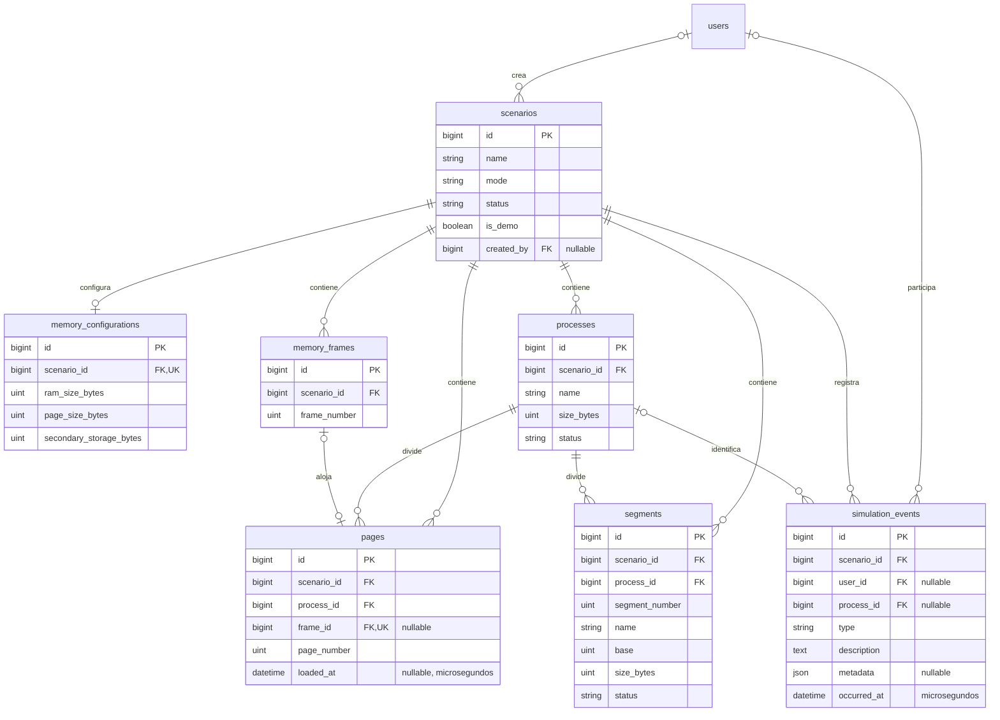

# Modelo de memoria de MemoryLab

Implementado en la Fase 8 mediante `2026_10_07_160000_create_memory_simulation_tables.php`, con InnoDB, claves primarias bigint y timestamps en las siete tablas. La implementación y las verificaciones originales utilizaron MySQL oficial; sus evidencias históricas conservan ese entorno.

La compatibilidad actual admite MySQL >= 8.0.16 o MariaDB >= 10.4.3, con drivers `mysql` o `mariadb`. La migración y `memorylab:database` comprueban motor y versión antes de crear las tablas del dominio. Ambos motores conservan las restricciones CHECK y las claves foráneas del modelo. [Laravel 12](https://laravel.com/framework/docs/12.x/database) admite MariaDB desde 10.3; MemoryLab requiere 10.4.3 porque esa versión incorpora automáticamente la validación JSON del esquema, según sus [notas de versión](https://mariadb.com/docs/release-notes/community-server/old-releases/10.4/10.4.3). Así se conserva la integridad de `simulation_events.metadata` junto con las [restricciones de MariaDB](https://mariadb.com/docs/server/reference/sql-statements/data-definition/constraint), sin variantes del esquema ni omisión de controles. `10.6.28-MariaDB`, informada por el hosting, satisface el mínimo de compatibilidad. Los mínimos técnicos no sustituyen la elección de una versión mantenida ni la comprobación de la instalación de destino.

## Relaciones

## Datos y unidades

| Tabla / modelo | Contenido y reglas |
| --- | --- |
| scenarios / Scenario | Nombre, descripción opcional, modo, estado, indicador de demostración y creador opcional. Un escenario en borrador puede existir sin configuración. |
| memory_configurations / MemoryConfiguration | RAM, tamaño de página y capacidad secundaria simulada, en bytes. Una configuración por escenario. El número de marcos es el accesor frame_count, calculado con intdiv(RAM, página). |
| processes / Process | Escenario, nombre, tamaño en bytes y estado. Los nombres de procesos pueden repetirse. |
| memory_frames / MemoryFrame | Escenario y número de marco. La página ocupante se obtiene mediante la relación page; un marco sin página está libre. |
| pages / Page | Escenario, proceso, número de página y marco opcional. El accesor present es true cuando frame_id no es null. RAM/DISCO se presenta a partir de ese vínculo. loaded_at conserva la fecha UTC de entrada en RAM para FIFO; puede ser null. |
| segments / Segment | Escenario, proceso, número y nombre de segmento, base y tamaño en bytes, y estado. La base es una dirección dentro de la memoria simulada. |
| simulation_events / SimulationEvent | Escenario, usuario y proceso opcionales, tipo, descripción, metadata JSON y fecha del evento. No requiere una página o segmento persistente para conservar los detalles históricos de una operación. |

Los atributos de bytes, bases y posiciones son INT UNSIGNED: admiten de 0 a 4 294 967 295, con restricciones adicionales para tamaños que deben ser positivos. Son valores matemáticos; almacenar un número grande no reserva esa cantidad de RAM física. La interfaz de configuración impondrá límites de operación al implementarse.

Una unidad presentada como KB equivale a 1024 bytes. Por ejemplo, 16 KB y páginas de 1 KB se persistirán como 16384 y 1024 bytes; el número de marcos será 16. Esta fase no carga ese ejemplo como datos.

Eventos: occurred_at es DATETIME(6), obligatorio y proporcionado por el código servidor con la hora UTC de la aplicación. SimulationEvent conserva microsegundos mediante dateFormat y tiene timestamps(6); metadata se convierte a array y occurred_at a fecha inmutable. La presentación local de fechas corresponde a la interfaz posterior.

## Estados

| Enum | Valores persistidos |
| --- | --- |
| SimulationMode | PAGING, SEGMENTATION, CONTIGUOUS |
| ScenarioStatus | DRAFT, READY, RUNNING, COMPLETED |
| ProcessStatus | READY, RUNNING, WAITING, TERMINATED |
| SegmentStatus | ACTIVE, RELEASED |
| SimulationEventType | PROCESS_CREATED, PAGE_REQUEST, PAGE_HIT, PAGE_FAULT, PAGE_LOADED, SEGMENT_ACCESS, SEGMENTATION_FAULT, MEMORY_RESET, SCENARIO_CREATED, MEMORY_CONFIGURED, PROCESS_TERMINATED |

Los valores se restringen con ENUM de MySQL/MariaDB y se convierten a enums PHP en los modelos. Los enums de PHP no sustituyen la validación de entrada ni la autorización de los futuros módulos.

## Integridad implementada

- Una configuración por escenario: unique(scenario_id).
- Marco único por escenario: unique(scenario_id, frame_number).
- Página y segmento únicos por proceso: unique(process_id, page_number) y unique(process_id, segment_number).
- Una página como máximo por marco: unique(frame_id). Varias páginas pueden tener frame_id null.
- El proceso de una página, segmento o evento debe pertenecer al mismo escenario. Se utilizan FK compuestas (scenario_id, process_id) hacia processes(scenario_id, id).
- El marco de una página debe pertenecer al mismo escenario: FK compuesta (scenario_id, frame_id) hacia memory_frames(scenario_id, id).
- Los padres processes y memory_frames tienen claves únicas (scenario_id, id) para esas referencias.
- CHECK impide nombres vacíos o solo espacios en escenarios, procesos y segmentos; impide tamaños cero de procesos y segmentos; exige RAM y página positivas, página no mayor que RAM y RAM divisible entre página.
- UNSIGNED impide bytes, bases o posiciones negativas. La capacidad secundaria puede ser cero.
- Las referencias del dominio usan RESTRICT al borrar. Los procesos asociados a historial se conservan y pueden pasar a TERMINATED; no se elimina su historial implícitamente.
- Creador del escenario y usuario del evento admiten null y usan SET NULL al borrar una cuenta, preservando el escenario y los eventos. Las FK compuestas del proceso usan RESTRICT, pues scenario_id sigue siendo obligatorio.

Las FK con columnas nullable siguen la semántica de [MySQL para claves foráneas](https://dev.mysql.com/doc/refman/8.0/en/ansi-diff-foreign-keys.html) y las [restricciones de MariaDB](https://mariadb.com/docs/server/reference/sql-statements/data-definition/constraint). Los CHECK validan reglas de la fila; no consultan otras tablas, conforme a las [restricciones de CHECK en MySQL](https://dev.mysql.com/doc/refman/8.0/en/create-table-check-constraints.html) y su aplicación en MariaDB. La compatibilidad del hosting mantiene estas restricciones; no se omiten para permitir la instalación.

## Índices y consultas previstas

Además de claves primarias, únicas e índices de FK, se agregan:

- scenarios(status, updated_at): listado por estado.
- processes(scenario_id, status): procesos activos de un escenario.
- simulation_events(scenario_id, occurred_at, id): historial con orden estable.
- simulation_events(scenario_id, type, occurred_at): filtros por evento y conteo de fallos de página.
- pages(scenario_id, loaded_at, id), agregado en Fase 15: orden de residentes para reemplazo FIFO.

scenario_id evita mezclar estado de distintas simulaciones. El control de acceso seguirá los permisos del proyecto y las policies de cada módulo; estas relaciones no asignan privilegios al creador ni crean un escenario activo automáticamente.

## Reglas de los Services posteriores

La Fase 8 define estructura e integridad relacional. Al implementar configuración, procesos, paginación y segmentación, los Services deberán comprobar, dentro de transacciones:

- La existencia de configuración antes de construir marcos o ejecutar una simulación.
- frame_number < frame_count y la cantidad correcta de marcos creados.
- La cantidad de páginas de cada proceso: ceil(size_bytes / page_size_bytes).
- La capacidad secundaria disponible y las reglas de asignación de marcos.
- base + size_bytes dentro de la RAM y ausencia de solapamiento entre segmentos activos.
- Las transiciones de estado y operaciones compatibles con el modo del escenario.
- Los permisos del actor, el escenario elegido y los datos del evento, incluidos los detalles necesarios para interpretar un historial tras un reinicio.
- La liberación de asignaciones y eliminación ordenada de datos cuando corresponda, conservando las referencias históricas requeridas.

Esas reglas entre registros no se atribuyen a los CHECK actuales. La reversión de esta migración elimina sus siete tablas en orden inverso y se verifica únicamente en la base de pruebas. MySQL ejecuta DDL con commits implícitos; una migración de varias tablas no equivale a una transacción de datos. Véase [sentencias con commit implícito](https://dev.mysql.com/doc/refman/8.0/en/implicit-commit.html).

## Configuración implementada en Fase 9

MemoryConfigurationService configura escenarios de paginación en una transacción. La entrada usa KB enteros, convierte a bytes y limita cada capacidad a 65.536 KB y el total a 1.024 marcos. El tamaño de página es positivo, no supera la RAM y la divide exactamente. Se crean los marcos 0 a frame_count − 1 junto con la configuración y los eventos SCENARIO_CREATED y MEMORY_CONFIGURED, con actor del servidor y snapshots en bytes.

Para reconfigurar, bloquea la fila del escenario con lockForUpdate; solo acepta DRAFT/READY sin ningún proceso, página o segmento. Reemplaza marcos libres y conserva historial. Un guardado idéntico no modifica filas, estados ni eventos. Los Services de asignación de las fases siguientes deben tomar el mismo bloqueo de escenario para coordinarse con la configuración.

ActiveScenarioService mantiene la selección explícita en la sesión, sin columna global de escenario activo ni privilegios adicionales por creador. Los escenarios se comparten según los permisos de consulta. MemoryStatisticsService calcula las estadísticas de paginación con una lectura transaccional limitada a ese escenario; los modos de segmentación y asignación contigua recibirán sus cálculos al implementar sus fases.

## Procesos implementados en Fase 10

ProcessManagerService crea procesos de paginación en estado READY, sin aceptar estados, marcos ni actor del cliente. Recarga al usuario y comprueba processes.create, bloquea el escenario y exige modo PAGING, estado READY/RUNNING, configuración válida y marcos consecutivos acordes a frame_count. No cambia el estado del escenario.

El tamaño usa KB enteros y se persiste en bytes. Las páginas se calculan con intdiv(size_bytes + page_size_bytes − 1, page_size_bytes) y se crean desde cero con frame_id null. Proceso, páginas y evento PROCESS_CREATED se guardan en una transacción; un error revierte las tres partes. Los límites configurables son 65.536 KB, 1.024 páginas por proceso y 100 procesos totales por escenario.

La capacidad secundaria utilizada se deriva de las páginas del escenario sin marco, multiplicadas por page_size_bytes. Una última página parcialmente utilizada reserva su tamaño completo. La creación exige espacio para todas las nuevas páginas y no asigna marcos. Los procesos terminados conservan sus páginas y su reserva mientras no exista una operación explícita que las libere. Un proceso mayor que la RAM es válido si cumple los límites y cabe en secundaria.

Este modelo muestra ubicación exclusiva: una página sin marco está en secundaria; con marco está en RAM. Las operaciones de paginación posteriores deberán respetar esta misma regla de capacidad y el bloqueo del escenario. No se simula una copia permanente de cada página en disco.

## Consulta de paginación implementada en Fase 11

PagingService::snapshot recibe actor, escenario y proceso opcional. Recarga al usuario y exige memory.view, tables.view y simulations.view antes de exponer datos. Una lectura transaccional reúne configuración, procesos, páginas, capacidades y último evento PAGE_REQUEST. No crea páginas, asigna marcos, modifica estados ni agrega eventos. Elegir el escenario cambia únicamente el contexto de la sesión; el proceso se selecciona explícitamente en el componente Livewire.

La consulta exige modo PAGING, geometría válida y marcos 0 a frame_count − 1. El índice único por escenario, la cantidad de marcos y sus extremos verifican esa numeración. Admite consultar escenarios completados y procesos finalizados sin cambiar sus estados. Comprueba los límites de 100 procesos por escenario y 1.024 páginas del proceso seleccionado; rechaza capacidades excedidas e inconsistencias sin reparar registros.

Los procesos se obtienen por la relación del escenario. Un ID de proceso ajeno o inexistente produce un error de validación, sin seleccionar otro proceso. Sus páginas se ordenan por page_number y la tabla básica presenta RAM si frame_id tiene valor, o DISCO cuando es null. RAM utilizada equivale a marcos ocupados × page_size_bytes; secundaria utilizada equivale a páginas sin marco × page_size_bytes. Los totales corresponden al escenario y los conteos del proceso seleccionado se presentan aparte. Los Services de configuración y procesos siguen siendo responsables de sus escrituras y bloqueo de escenario.

La última solicitud de CPU se filtra por escenario, proceso y tipo PAGE_REQUEST, con orden descendente por occurred_at e id. Se conserva la descripción registrada; page_number solo se muestra cuando metadata contiene un entero no negativo. Un evento de petición no demuestra que el acceso haya terminado. Sin un proceso seleccionado o evento correspondiente, la interfaz presenta su estado vacío. Los eventos conservan UTC y precisión de microsegundos; su presentación usa America/Guatemala, configurado en memorylab.display_timezone.

PagingSimulator obtiene estos datos en servidor, muestra los cinco paneles y actualiza la lectura mientras está visible. La tabla de ubicación pagina de 15 en 15; valida y limita su número de página, incluyendo parámetros manipulados, y reinicia al cambiar selección. Las tablas detalladas, mapa de marcos y operaciones de solicitud y carga continúan en las Fases 12 a 15. El usuario autorizó seguir las fases del plan sin nuevas pausas para aprobación.

## Tabla y mapa de memoria implementados en Fases 12 y 13

El componente Blade paging.page-table presenta Página, Marco, Presente y Estado desde el paginator del snapshot. Utiliza page_number y frame.frame_number para mostrar la numeración académica, preservando el marco cero. Una página con frame_id tiene presencia y estado RAM; sin marco muestra guion, «No» y DISCO. La consulta no modifica esas relaciones ni persiste indicadores duplicados.

PagingService agrega frames al snapshot mediante la relación del escenario, ordenados por frame_number y con page.process cargados anticipadamente. Antes de obtener esa colección valida la geometría, rango consecutivo y límite de 1.024 marcos. La carga de página y proceso evita consultas adicionales al renderizar cada bloque. Marcos, páginas, capacidades e historial pertenecen a la misma lectura transaccional.

paging.memory-grid representa el conjunto de marcos del escenario, incluidos ocupantes de procesos diferentes al seleccionado. Un marco sin página se presenta libre en gris; con página se muestra ocupado en azul, con nombre del proceso y número de página. El borde morado identifica las páginas del proceso elegido. No se agrega una columna de ocupación: el estado se deriva de la relación MemoryFrame.page.

PagingSimulator pagina los marcos de la colección en grupos de 64 con framesPage, y las páginas del proceso sin marco en grupos de 15 con secondaryPage. La tabla conserva pagesPage. Las tres paginaciones normalizan parámetros y se limitan a su rango válido; al cambiar escenario se reinician todas, mientras cambiar de proceso reinicia tabla y secundaria. El mapa usa dos, cuatro o seis columnas según el ancho mediante Bootstrap.

El panel secundario conserva capacidades globales del escenario y muestra únicamente las páginas ausentes del proceso elegido, identificadas por nombre y page_number. El mapa y secundaria usan el snapshot del padre, sin consultas SQL ni lógica de asignación en Blade. Estas fases preservan memoria e historial; la solicitud CPU y la carga de páginas continúan en las Fases 14 y 15.

## Registro de CPU implementado en Fase 14

PagingService::beginRequest registra la petición como una operación separada de su resolución. Bloquea la fila del escenario en una transacción, recarga al actor y exige pages.request y simulations.execute. Reutiliza snapshot para comprobar los tres permisos de lectura, modo, configuración, capacidades y relaciones del escenario. Requiere READY/RUNNING, un proceso no finalizado y páginas consecutivas cuyo total corresponda a ceil(size_bytes / page_size_bytes).

La página solicitada debe pertenecer a ese proceso y cumplir el límite configurado. Se registra exactamente un PAGE_REQUEST por llamada válida, con actor y relaciones elegidos en servidor. Metadata conserva page_number, page_id, page_size_bytes, nombre del proceso y número de marco observado. La respuesta incluye el ID del evento y la presencia al registrar la petición. beginRequest por sí solo no modifica page.frame_id, configuración, procesos o estados, ni registra PAGE_HIT, PAGE_FAULT o PAGE_LOADED.

PageRequest utiliza contexto de escenario y proceso reactivo, recreado por la clave del padre al cambiar selección. El resultado está protegido con Locked y los permisos se comprueban de nuevo antes de actuar y renderizar. El evento memory-updated solicita al padre una nueva lectura. Observador consulta la última solicitud sin formulario de escritura.

Esta sección documenta el contrato del registro y la entrega histórica de la Fase 14: la interfaz mostraba inspección de la tabla y resolución pendiente. La Fase 15 añade la operación de resolver peticiones y la integra con la acción CPU; sus cambios y verificaciones se documentan por separado.

## Resolución y FIFO implementados en Fase 15

La migración 2026_10_07_220000_add_loaded_at_to_pages_table agrega loaded_at DATETIME(6) nullable y pages_fifo_index(scenario_id, loaded_at, id). Es una ampliación del esquema aplicada sin borrar registros. Page utiliza un cast inmutable y dateFormat con microsegundos para conservar la precisión al escribir la fecha UTC de carga.

PagingService::requestPage integra beginRequest y resolveRequest en una transacción. Un error de resolución revierte también la petición de esa operación automática. Los métodos separados permiten conservar una petición pendiente para los flujos posteriores. Resolver bloquea primero el escenario, recarga al actor y comprueba los cinco permisos de lectura y escritura. Solo admite eventos PAGE_REQUEST del mismo autor, con proceso y metadata válida; la página actual debe coincidir en ID, número y tamaño con la referencia registrada.

La resolución busca primero PAGE_HIT o PAGE_LOADED del proceso vinculado mediante metadata.request_event_id. Valida el resultado almacenado contra el contexto de la petición y lo devuelve si existe, evitando duplicar cambios o eventos. El escenario bloqueado serializa la resolución con configuración, creación de procesos y otras operaciones de memoria. La idempotencia corresponde al ID del evento: un nuevo acceso a la misma página registra otra petición.

Una página presente registra PAGE_HIT y conserva su marco y loaded_at. Una ausente registra PAGE_FAULT, elige el menor frame_number libre y carga la página; si no hay marcos libres, selecciona la víctima residente del escenario por loaded_at e id. Las fechas null de asignaciones anteriores tienen prioridad como antigüedad desconocida. La víctima vuelve a secundaria con frame_id y loaded_at null; el objetivo recibe el marco y la fecha de carga actual. Los Hits no renuevan esa fecha, por lo que el criterio es FIFO y no LRU.

La capacidad secundaria final es ocupación anterior menos una página por el objetivo que sale de secundaria, más una página cuando existe víctima. Debe estar dentro de la capacidad configurada. Primero se libera la víctima y después se asigna el objetivo, respetando unique(frame_id). Se registra PAGE_LOADED con el resultado y los datos de víctima cuando corresponde. Eventos, página objetivo, víctima y estados se persisten dentro de la misma transacción.

El proceso accedido y escenario pasan a RUNNING. El resultado conserva marco y dirección física inicial frame_number × page_size_bytes; la traducción de una dirección con offset corresponde a la Fase 17. El evento memory-updated refresca los componentes de lectura, y DashboardStats también responde a ese evento y consulta el conteo real de PAGE_FAULT. La visualización no mantiene contadores de fallos o presencia separados de los registros.

## Recorrido y animaciones implementados en Fase 16

PageRequest permite los modos automatic y step. El modo automático mantiene requestPage como una transacción que registra y resuelve el acceso; después presenta el recorrido completo. El modo paso a paso registra primero PAGE_REQUEST mediante beginRequest y conserva su referencia en el componente. PagingFlowService define cuatro pasos para un Hit y ocho para un Fault, con textos educativos sin acceder a la base.

En el recorrido manual de un Hit, resolveRequest se invoca en el paso 4. En un Fault, los pasos 1 a 5 muestran petición, consulta, ausencia, fallo y búsqueda de marco; la resolución atómica ocurre en el paso 6. Los pasos 7 y 8 explican la tabla actualizada y la finalización del acceso ya resuelto. Los pasos intermedios no persisten fases parciales de carga ni eventos Hit/Fault anticipados.

pending, step, stateChanged y result utilizan Locked. Cada avance comprueba de nuevo los permisos del actor; el cliente no decide el resultado, marco o víctima. Al resolver se inspecciona la presencia actual bajo el bloqueo de escenario. Si otro acceso cambió esa presencia desde la petición, el componente adapta el recorrido al Hit o Fault real y lo informa. La resolución conserva la idempotencia del evento definida en la Fase 15.

Cambiar página o modo, o cerrar el recorrido, limpia únicamente su estado de presentación. Un PAGE_REQUEST ya registrado permanece en el historial aunque se abandone el recorrido antes de resolver. El progreso pertenece al componente del actor y se conserva al refrescar su contexto mediante polling; cambiar de escenario o proceso recrea el componente. Las otras sesiones consultan memoria y última petición persistida, sin recibir el progreso local de ese recorrido.

El evento memory-accessed comunica el resultado para la animación. memory-flow.js resalta los pasos y el marco del DOM después de completar un acceso automático; no calcula presencia, capacidad, direcciones o asignaciones. La preferencia prefers-reduced-motion desactiva estos resaltados temporales. Cambiar de navegación cancela sus temporizadores. El modo manual muestra el paso actual mediante el estado renderizado en servidor. La Fase 16 no agrega columnas ni tablas al esquema; continúa la traducción de direcciones en la Fase 17.

## Traducción de direcciones implementada en Fase 17

AddressTranslationService::translate recibe actor, escenario, proceso y dirección lógica entera en bytes. Recarga al actor y exige results.view, además de memory.view, tables.view y simulations.view mediante el snapshot de PagingService. Consulta configuración y páginas en una lectura transaccional, comprueba el total y numeración consecutiva de páginas y mantiene el proceso dentro de su escenario.

La dirección debe estar entre cero y size_bytes − 1. El espacio de relleno de una última página parcialmente utilizada no pertenece al proceso y se rechaza. La página se calcula con intdiv(logical_address, page_size_bytes) y el offset con logical_address % page_size_bytes. Si la página tiene marco, physical_address = frame_number × page_size_bytes + offset; se utiliza la numeración del marco, incluido cero, y no su ID de base de datos.

Una página sin marco devuelve present false, frame_number null y physical_address null. Traducir no llama a beginRequest ni resolveRequest: no carga páginas, cambia estados o fechas FIFO, ni registra PAGE_REQUEST, Hit o Fault. Se puede consultar un proceso finalizado o escenario completado que conserve datos válidos. El resultado describe la asignación de la lectura; un acceso posterior puede cambiarla y requiere volver a calcular.

AddressTranslator permite la consulta a los tres roles con esos permisos, conserva el resultado mediante Locked y elimina ese resultado al cambiar escenario, proceso o dirección. La selección de escenario continúa en la sesión, sin elegir un proceso automáticamente. La interfaz muestra cada operación y señala ausencia de dirección física cuando la página está en secundaria. Esta fase no modifica el esquema.

## Segmentación implementada en Fase 18

SegmentationService crea escenarios SEGMENTATION en READY, con configuración de RAM en KB enteros y límite de 65.536 KB. Reutiliza memory_configurations: page_size_bytes = 1024 y secondary_storage_bytes = 0 satisfacen el esquema común, pero este modo no crea marcos ni páginas. El tamaño de página de esa configuración no divide los segmentos ni determina sus límites. Crear el escenario exige memory.configure y scenarios.create; configuración y eventos SCENARIO_CREATED/MEMORY_CONFIGURED se guardan en una transacción.

createProcess exige processes.create y un escenario listo o en ejecución. Bloquea su fila, valida el estado completo y crea un proceso READY con tamaño en bytes y PROCESS_CREATED. No reserva RAM ni crea segmentos automáticamente. Conserva los límites de 65.536 KB por proceso y 100 procesos por escenario, incluidos finalizados.

createSegment exige segmentation.execute y simulations.execute y toma el mismo bloqueo del escenario. El proceso debe pertenecer a ese escenario y no estar finalizado. El nombre se valida y recorta; base es un entero no negativo y size_bytes un entero positivo. El intervalo [base, base + size_bytes) debe quedar dentro de RAM y no cruzarse con ningún segmento ACTIVE de cualquier proceso; los intervalos adyacentes son válidos. La suma de tamaños activos del proceso no puede exceder process.size_bytes. La numeración se asigna por proceso desde cero y conserva unicidad. Los límites son 16 segmentos por proceso y 1.024 por escenario, incluidos RELEASED.

snapshot exige los tres permisos de consulta y utiliza una lectura transaccional. Antes de cargar colecciones cuenta procesos y segmentos para aplicar sus límites. Ordena segmentos activos globales por base e ID; un cursor valida superposición y límites y produce bloques ocupados y huecos libres. Comprueba también el presupuesto de cada proceso. La tabla conserva los segmentos del proceso elegido, incluidos liberados; el mapa y su ocupación consideran únicamente ACTIVE de todo el escenario. Relaciones de proceso cargadas anticipadamente evitan consultas por bloque en Blade.

SegmentationSimulator permite seleccionar escenario y proceso, conserva el contexto de escenario en la sesión y actualiza la consulta cada cinco segundos mientras está visible. Los permisos se comprueban otra vez al actuar y renderizar. Administrador configura; Administrador y Operador crean procesos y segmentos; Observador consulta. La tabla muestra número, nombre, base, tamaño/límite y estado, y el mapa combina intervalos proporcionales con bloques que identifican su rango y proceso.

MemoryStatisticsService incorpora una rama SEGMENTATION en el mismo snapshot de lectura. Cuenta los segmentos antes de obtenerlos y reutiliza MAX_SEGMENTS_PER_SCENARIO. Ordena ACTIVE por base e ID y verifica límites, ausencia de superposición y suma no superior a RAM. Calcula RAM utilizada por suma de size_bytes, disponible por diferencia y procesos activos excluyendo TERMINATED. Devuelve null para marcos totales, usados, libres y Page Faults; el dashboard presenta «No aplica», data-not-applicable y «Solo paginación». No altera la rama PAGING ni crea indicadores persistidos.

Esta entrega implementa configuración, asignación y consulta. Los accesos con segmento/offset y eventos SEGMENT_ACCESS/SEGMENTATION_FAULT continúan en la Fase 19. No se añade una migración ni se representa una copia de segmentos en almacenamiento secundario.

## Accesos y fallos de segmentación implementados en Fase 19

SegmentationService::access recibe actor, escenario, proceso, número de segmento y offset. Bloquea el escenario en una transacción y recarga al usuario para comprobar segmentation.execute, simulations.execute y los tres permisos de consulta mediante snapshot. Requiere un escenario READY/RUNNING, proceso del escenario no finalizado y segmento ACTIVE del proceso elegido. Número y offset deben estar entre cero y 4294967295; entradas negativas, segmento inexistente/liberado o contexto ajeno generan validación sin eventos.

El límite de cada segmento es size_bytes, por lo que offset < size_bytes permite el acceso y calcula physical_address = base + offset. Se registra un SEGMENT_ACCESS con actor, proceso y metadata de segmento, número, nombre, base, tamaño, offset, último offset válido y dirección física. Un acceso válido pasa proceso y escenario a RUNNING. Estado y evento pertenecen a la misma transacción.

Un offset entero no negativo que alcanza o supera size_bytes genera SEGMENTATION_FAULT y physical_address null. Este rechazo simulado se registra en el historial, conservando los estados anteriores. Ninguno de los dos resultados carga páginas, reasigna segmentos, modifica la RAM ocupada o crea una dirección física fuera del intervalo. El criterio es estricto: el último offset válido es size_bytes − 1.

SegmentAccess utiliza contexto Reactive y una clave del padre compuesta por escenario y proceso; hay un solo componente de acceso por selección. El resultado utiliza Locked y se limpia al cambiar segmento u offset. Los permisos se comprueban al actuar y renderizar. La interfaz expone segmentos activos, cálculo y comparación del offset; Observador consulta tabla y mapa sin formulario de acceso. memory-updated solicita una lectura nueva tras persistir el evento.

La Fase 19 reutiliza los tipos de evento y tablas existentes. No agrega una migración ni libera o termina procesos automáticamente. La comparación educativa de técnicas continúa en la Fase 20.

## Comparación implementada en Fase 20

MemoryComparisonService calcula un ejemplo independiente de los escenarios persistidos. RAM_SIZE_BYTES = 16384 y PAGE_SIZE_BYTES = 1024; los procesos ilustrativos A y B ocupan 4096 y 3072 bytes, dejando huecos [4096, 7168) y [10240, 16384). La memoria libre inicial suma 9216 bytes y el mayor hueco mide 6144. Cada técnica parte de ese mismo estado y recibe una solicitud entera entre 1 y 16384 bytes.

Contigua utiliza first fit por base ascendente para ubicar el proceso completo en un único intervalo. Paginación redondea con ceil(solicitud / 1024) y utiliza los marcos libres 4, 5, 6 y 10 a 15; este ejemplo exige que todas las páginas de la solicitud quepan en RAM. Segmentación divide la solicitud de forma ilustrativa: Datos = min(3072, intdiv(solicitud × 3, 7)) y Código = solicitud − Datos. Asigna Código y después Datos con first fit; una partición de tamaño cero se omite. Si un segmento no cabe, descarta toda la asignación de esa técnica.

Cada resultado incluye aceptación, intervalos finales, reserva nueva, espacio interno sin utilizar, memoria libre final y mayor hueco. Un rechazo mantiene el mapa inicial y reserva cero. Las unidades y fórmulas son enteras; el mapa ocupa exactamente 16384 bytes y conserva separados bloques existentes, asignados y libres. La división Código/Datos explica una posibilidad concreta y no garantiza que cualquier conjunto de segmentos encaje.

MemoryComparison permite consultar a los tres roles con memory.view, tables.view, simulations.view y results.view. Comprueba permisos al actuar y renderizar, valida el tamaño y protege el resultado mediante Locked. Blade presenta los tres mapas, sus intervalos y una tabla de propiedades. El servicio no consulta ni escribe tablas, no selecciona escenarios y no registra accesos. No implementa un asignador persistente CONTIGUOUS ni reemplazo o carga por demanda dentro de este ejemplo.

La distinción entre páginas y marcos fijos se apoya en [OSTEP: Paging](https://pages.cs.wisc.edu/~remzi/OSTEP/vm-paging.pdf). La asignación independiente de segmentos y su fragmentación externa se apoya en [OSTEP: Segmentation](https://pages.cs.wisc.edu/~remzi/OSTEP/vm-segmentation.pdf). First fit toma el primer hueco suficiente y conserva su sobrante libre, como describe [OSTEP: Free-Space Management](https://pages.cs.wisc.edu/~remzi/OSTEP/vm-freespace.pdf). Los tamaños y la partición de este comparador son decisiones educativas propias de MemoryLab.

## Alta demanda implementada en Fase 21

MemoryStressService::run recibe actor, ID explícito de escenario y cantidad/tamaño de procesos. Bloquea el escenario antes de leerlo, recarga permisos de creación de procesos, solicitud de páginas, ejecución y lectura, y mantiene la operación completa en una transacción. Requiere paginación READY/RUNNING y un snapshot consistente. Cada lote utiliza un UUID de servidor y nombres ficticios derivados de él; los campos ajenos enviados por el cliente no determinan actor, escenario o nombres persistidos.

Los límites son ocho procesos, 64 KB por proceso y 64 páginas solicitadas en total. El número de páginas se calcula por redondeo entero con el tamaño del escenario. ProcessManagerService crea primero todos los procesos y reserva sus páginas completas en secundaria. La reserva debe caber antes de iniciar accesos a RAM; cualquier error de creación o resolución revierte procesos, páginas, estados y eventos de todo el lote.

Después se accede a cada página nueva en orden, mediante PagingService::requestPage, conservando su validación, transacciones, eventos e intercambio FIFO. El servicio registra por solicitud un resultado local con proceso, página, marcos usados y bytes ocupados; cuenta reemplazos y devuelve snapshots antes/después de RAM, secundaria, procesos activos y Page Faults acumulados. No añade un tipo de evento STRESS ni duplica el algoritmo de paginación.

MemoryStress permite selección explícita de escenario, cantidad y tamaño. El resultado está protegido por Locked y se limpia al cambiar escenario. La interfaz muestra seis indicadores actuales, métricas antes/después, procesos creados y la secuencia calculada de ocupación; memory-updated solicita actualizar otros componentes tras completar la transacción. El estado actual incluye Page Faults acumulados y secundaria para Observador, con polling cada cinco segundos mientras está visible. La evolución es una traza de la ejecución terminada, no estados de una transacción parcialmente guardada. La interfaz exige además results.view para presentar sus resultados; el servicio aplica los permisos operativos de creación, solicitud, ejecución y las tres consultas de memoria.

Esta implementación no agrega tablas o columnas ni inicia procesos reales. Sus colecciones y solicitudes tienen límites independientes del tamaño matemático de RAM. La Fase 21 se verificó con 35 pruebas, 153 assertions y navegador; su evidencia conserva el fixture de seis solicitudes y cuatro reemplazos FIFO.

## Demostración y reinicio implementados en Fase 22

SimulationService::startDemo crea un par nuevo PAGING/SEGMENTATION con is_demo y devuelve sus IDs y UUID de ejecución. Utiliza los servicios existentes dentro de una transacción. Paginación tiene 16384 bytes de RAM, páginas de 1024, 16 marcos y 65536 bytes de secundaria; crea Chrome de 4 KB, Spotify de 3 KB, VS Code de 6 KB y MemoryLab de 2 KB. Solicita Chrome P0/P1, Spotify P0 y VS Code P0/P1 mediante PagingService: cinco páginas quedan cargadas con sus eventos reales. Chrome P3 permanece ausente.

El escenario de segmentación tiene 16 KB de RAM y un proceso Editor de 4 KB. Crea Código [1000, 2200), Datos [4000, 4800), Stack [7000, 7600) y Heap [9000, 10000), con un total de 3600 bytes. El par permite consultar un Hit/Fault conocido y el límite estricto de Código sin modificar un escenario manual anterior. Crear la demo exige permisos actuales de configuración, escenarios, procesos, solicitud de páginas, ejecución, segmentación y las tres consultas.

SimulationService::reset bloquea un ID explícito de escenario, recarga memory.reset, simulations.execute y los permisos de consulta, y valida modo/configuración y estado READY/RUNNING. Elimina pages, marca segmentos ACTIVE como RELEASED y procesos no finalizados como TERMINATED. Conserva escenario, configuración, marcos, procesos y eventos previos; vuelve el escenario a READY y agrega un MEMORY_RESET con los conteos y actor. Todo pertenece a una transacción. Un reinicio repetido registra otra acción explícita con conteos cero; no borra historial.

La eliminación de páginas libera RAM y secundaria sin trasladar todas las páginas al disco simulado. Evita superar la capacidad secundaria en escenarios que admitieron procesos nuevos después de otras cargas. Los procesos retenidos y segmentos liberados siguen contando contra sus límites de creación; cambiar configuración continúa sujeto a sus reglas anteriores. El contador Page Faults conserva el historial acumulado del escenario.

resolveRequest conserva primero un resultado terminal previo como historia. Si la petición sigue pendiente y existe un MEMORY_RESET posterior por ID en el mismo escenario, la rechaza antes de intentar resolver: no recrea páginas o revive procesos. restartDemo requiere también los permisos de crear el nuevo par, bloquea los dos IDs antiguos en orden ascendente, reinicia cada uno, los marca COMPLETED y crea otro par en la misma transacción. Un error revierte tanto la liberación anterior como la nueva preparación.

SimulationDemo guarda los IDs del par en sesión después de una preparación exitosa; demo y resetResult utilizan Locked. No identifica escenarios por nombre ni elige la última demo. La sesión se valida por modo, is_demo, estado y procesos no finalizados en ambos escenarios. Liberar cualquiera de los IDs del par local limpia su tarjeta y referencia de sesión; las demos sin procesos activos no se anuncian como preparadas. Los tres roles consultan, mientras los permisos del catálogo reservan preparación y reinicio a Administrador.

La Fase 22 no añade tablas o migraciones. Se verificó con 54 pruebas de demostración/reinicio y 21 regresiones de paginación: 75 aprobadas y 364 assertions. El navegador comprobó creación, Hit/Fault, nuevas generaciones, liberación y controles de los tres roles. Continúa el historial en la Fase 23.

## Historial implementado en Fase 23

SimulationHistoryService::search recarga al actor y exige history.view. El catálogo reserva este permiso a Administrador; Operador y Observador reciben 403 y el menú no expone el enlace. La consulta utiliza filtros explícitos y parámetros vinculados para escenario, proceso, usuario, tipo de SimulationEventType y fechas. Un proceso filtrado requiere escenario y debe pertenecer a él; no se acepta un ID ajeno ni campos de filtro desconocidos. Los valores presentes compuestos solo por espacios se rechazan antes de la validación nullable.

Los filtros de fecha aceptan YYYY-MM-DD entre 1000-01-01 y 9999-12-30, con inicio no posterior al fin. Cada extremo se interpreta en America/Guatemala: inicio inclusivo al comienzo del día, fin exclusivo al comienzo del día siguiente, convertidos a UTC. Esto incluye los microsegundos del último día y evita producir un año fuera del rango de MySQL. La interfaz presenta los instantes en Guatemala; la persistencia conserva UTC.

La consulta ordena occurred_at descendente y después ID descendente, carga escenario, proceso y actor, y pagina 20 filas. Cuenta y obtiene las filas dentro de una transacción de lectura, normalizando la página al rango disponible. SimulationHistory utiliza paginación Bootstrap, reinicia la página al cambiar filtros y presenta mensajes de validación en español. Filtrar historial no cambia la selección de escenario del simulador, ni asignaciones, estados o eventos.

La Fase 23 no agrega tablas o migraciones. Se verificó con 36 pruebas, 213 assertions y navegador: 21 eventos paginados, cinco Faults filtrados, dos eventos de Chrome y rechazo de los otros dos roles, conservando las siete tablas del dominio. Continúa la terminal educativa en la Fase 24.

## Terminal educativa implementada en Fase 24

EducationalTerminalService::execute recibe usuario, ID de escenario y una cadena UTF-8 de hasta 160 caracteres. Rechaza controles, saltos de línea y comandos desconocidos. Interpreta exclusivamente help, memory status, process list, page table {nombre o #ID}, request {nombre o #ID} {página} y reset mediante patrones anclados. No ejecuta instrucciones del sistema operativo ni construye SQL o comandos de Artisan con el texto recibido.

El servicio recarga al actor y exige memory.view, tables.view, simulations.view y results.view. Obtiene el snapshot del modo del escenario. Resuelve procesos dentro de esa colección por nombre exacto sin distinguir mayúsculas o por ID positivo; un nombre repetido requiere #ID. page table y request solo aceptan paginación. El número de página debe ser un entero entre cero y 4294967295 y se valida de nuevo en el servicio de acceso.

help y las tres consultas conservan datos. page table presenta hasta 40 páginas y remite al simulador para las restantes. request llama PagingService::requestPage, conserva sus permisos y transacción, y presenta pasos, Hit/Fault, marco, dirección inicial y víctima FIFO. reset llama SimulationService::reset: exige sus permisos actuales, finaliza procesos y libera asignaciones conservando configuración e historial. No se duplica el algoritmo ni se evitan sus bloqueos.

EducationalTerminal mantiene lines y result mediante Locked, limita la consola a las últimas 100 líneas y escapa su salida en Blade. Cambiar escenario limpia la presentación local; Limpiar consola conserva los eventos guardados. Las respuestas representan el momento de ejecutar el comando. Una mutación exitosa emite memory-updated para actualizar otros componentes, y los permisos se revisan al actuar y renderizar.

La Fase 24 no agrega tablas o migraciones. Terminal y regresiones de modo manual y acceso de segmentación aprobaron 96 pruebas y 703 assertions. El navegador comprobó consultas intactas para los tres roles, un Hit y un Fault con cinco eventos nuevos exactos, y reset administrativo sin páginas. Continúa el modo presentación en la Fase 25.

## Modo presentación implementado en Fase 25

La ruta /presentation requiere los cuatro permisos de consulta y utiliza PagingSimulator con presentation protegido mediante Locked. Su layout académico conserva los recursos locales de Sneat/Livewire y el control de pantalla completa, y presenta cinco paneles: selección/procesos, CPU, tabla de páginas, RAM y secundaria. Reutiliza PageRequest, page-table y memory-grid; elimina formularios y enlaces de administración de la pantalla de exposición. Seleccionar o abrir no prepara demos ni ejecuta accesos automáticamente.

El padre utiliza el mismo snapshot para tabla, RAM, secundaria y Page Faults acumulados, con polling visible de cinco segundos. Las capacidades y marcos corresponden al escenario; las páginas y resultado al proceso elegido. CPU conserva sus permisos operativos y modos automático/paso a paso. Observador consulta los mismos datos y el resultado de otra cuenta, sin recibir controles de acceso.

PagingService agrega last_result como proyección de la última PAGE_REQUEST seleccionada y su evento terminal PAGE_HIT/PAGE_LOADED, vinculado por request_event_id. Comprueba IDs, contexto, tipos, página, tamaño, marco, dirección y víctima antes de exponer una estructura canónica. Una petición pendiente no muestra un resultado terminal; un MEMORY_RESET posterior limpia la proyección. Leer conserva eventos y asignaciones, sin llamar a resolveRequest. PageRequest muestra el resultado local o, cuando no existe recorrido pendiente, el resultado persistido y su flujo completo; un proceso finalizado limpia el recorrido local.

La misma entrega agrega last_access validado a SegmentationService para consultar el último SEGMENT_ACCESS/SEGMENTATION_FAULT del proceso, con segmento, base, límite, offset y dirección coherentes. SegmentAccess puede presentar ese resultado compartido mediante polling del módulo habitual. Ambas proyecciones incluyen el instante persistido y conservan los permisos de lectura.

La Fase 25 no agrega tablas o migraciones. Presentación aprobó 34 pruebas específicas más 13 de modo paso a paso y 32 de acceso de segmentación: 79 pruebas y 515 assertions. El navegador comprobó tres roles, cinco paneles, resultado compartido por polling, reset con 16 marcos libres y anchos entre 320 y 1920 píxeles, conservando el hash de lectura.

## Seeder de demostración implementado en Fase 26

MemoryDemoSeeder es una operación explícita independiente de DatabaseSeeder, que conserva únicamente RolesAndPermissionsSeeder. Requiere una cuenta existente con el rol administrador del guard web, selecciona la de menor ID y bloquea su fila dentro de una transacción con hasta tres intentos. No crea cuentas, cambia roles o modifica contraseñas.

Las constantes PAGING_NAME y SEGMENTATION_NAME identifican «Demostración base: paginación» y «Demostración base: segmentación». Solo se consideran escenarios is_demo con esos nombres; los manuales homónimos y las demás demos se conservan. Si ninguno existe, startDemo prepara la pareja mediante los servicios de Fase 22 y el seeder renombra exclusivamente los IDs recién devueltos. Paginación inicia con 16 marcos, cinco páginas residentes y diez ausentes; segmentación con cuatro segmentos activos y 3600 bytes ocupados.

Si ya existe la pareja exacta de modos correctos, se validan ambos snapshots y no se escribe. Este comportamiento conserva accesos posteriores, una liberación de memoria y el estado COMPLETED; no recrea páginas ni reactiva segmentos o procesos. Un par parcial, nombres demo duplicados o modo incorrecto producen RuntimeException sin cambios. La memoria inconsistente propaga ValidationException del snapshot. Fallar cualquiera de las partes de la preparación revierte la transacción completa.

Las pruebas específicas aprobaron 19 casos y 99 assertions en memorylab_testing, incluyendo hashes de las siete tablas del dominio y conservación de cuentas y contraseñas. La ejecución sobre la base local principal agregó solo la pareja base; los hashes de filas anteriores y cuentas/catálogo permanecieron intactos. Una segunda ejecución no produjo cambios. La base conserva dos usuarios, tres roles, 13 permisos, tres escenarios/configuraciones, cinco procesos, 32 marcos, 15 páginas, cuatro segmentos y 26 eventos. No se añade migración ni credenciales al repositorio. Continúa la verificación integral en la Fase 27.
